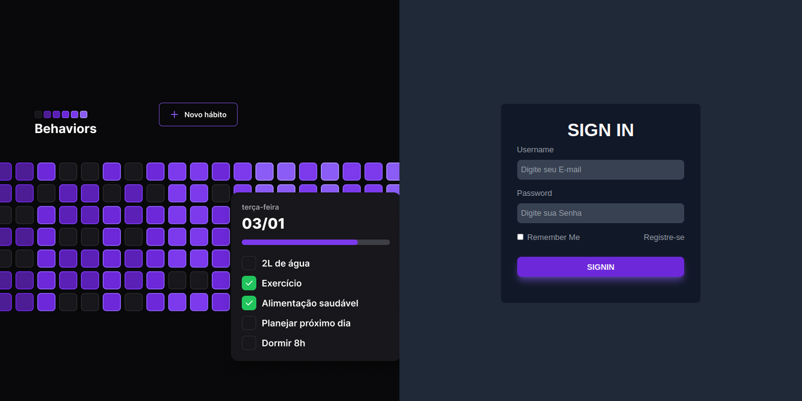
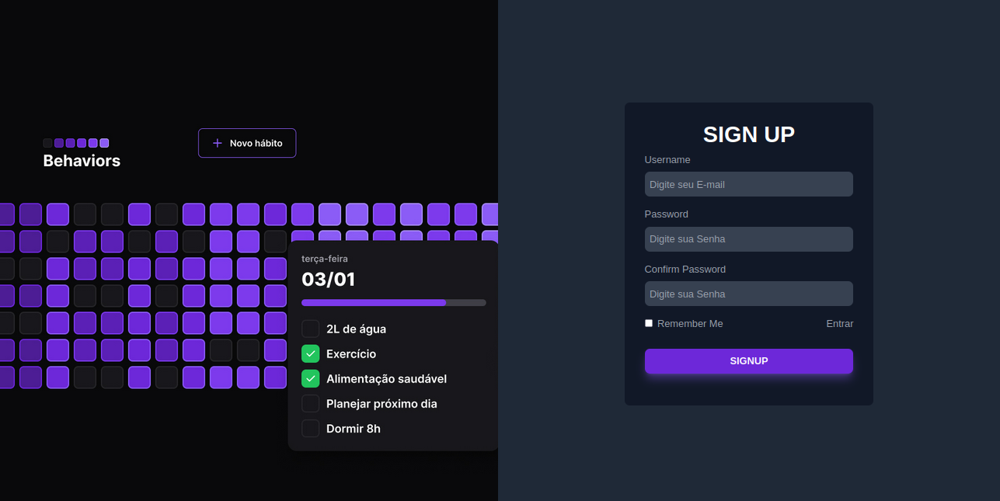
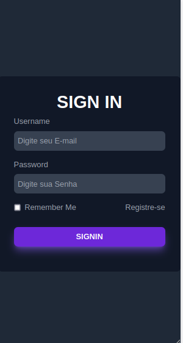
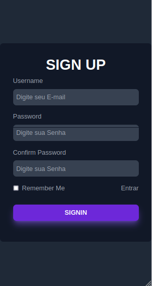

<div align="center" id="top">
  

  &#xa0;


  <a href="https://behaviors.vercel.app/">Demo</a>
</div>

<h1 align="center">Página de login Responsiva</h1>

<p align="center">
  

  

  

  

  

  

  
</p>


<hr>

<p align="center">
  <a href="#-sobre">Sobre</a> &#xa0; | &#xa0;
  <a href="#telas-da-aplicação">Telas</a> &#xa0; | &#xa0;
  <a href="#skateboard-funcionalidades">Funcionalidades</a> &#xa0; | &#xa0;
  <a href="#rocket-tecnologias">Tecnologias</a> &#xa0; | &#xa0;
  <a href="#white_check_mark-requisitos-para-rodar-a-aplicação">Requisitos</a> &#xa0; | &#xa0;
  <a href="#checkered_flag-iniciando">Iniciando</a> &#xa0; | &#xa0;
  <a href="#-configurações-adicionais-ao-projeto">Schemas</a> &#xa0; | &#xa0;
  <a href="#memo-licença">Licença</a> &#xa0; | &#xa0;
  <a href="https://github.com/juniorvilas" target="_blank">Autor</a>
</p>

<br>

## 😸 Sobre ##
 Tela de login responsiva desenvolvida utilizando a poderosa biblioteca React. Esta tela de login foi cuidadosamente projetada para proporcionar uma experiência de usuário suave e intuitiva, independentemente do dispositivo utilizado.

## Telas da aplicação

### Tela Login Desktop ##


## Tela Cadastro Desktop ##



### Tela Login Mobile ##



## Tela de cadastro mobile ##




## :skateboard: Funcionalidades ##

:heavy_check_mark: Iniciar sessão do usuário\
:heavy_check_mark: Cadastrar novos usuários\
:heavy_check_mark: Rotas adaptativas\
:heavy_check_mark: Sistema de gerenciamento de sessão local ou remoto\
:heavy_check_mark: Aplicação responsiva

## :rocket: Tecnologias ##

Abaixo poderá ter acesso às principais tecnologias usadas neste projeto


- [TypeScript](https://www.typescriptlang.org/)
- [Svg-Transformer](https://github.com/kristerkari/react-native-svg-transformer)
- [Phosphor Icons](https://github.com/duongdev/phosphor-react-native)
- [Prisma](https://www.prisma.io/)
- [Fastfy](https://www.fastify.io/)
- [Tailwindcss](https://tailwindcss.com/)
- [Radix-ui](https://www.radix-ui.com/)


## :white_check_mark: Requisitos para rodar a aplicação ##

## :checkered_flag: Iniciand Frontend Mobile  ##

```bash
# Clone este projeto
$ git clone https://github.com/AlcivanLucas/LoginPage.git

# Acesse
$ cd/LoginPage/

```

## :checkered_flag: Iniciando Frontend Web  ##

```bash
# Clone este projeto
$ git clone https://github.com/AlcivanLucas/LoginPage.git

# Acesse
$ cd/LoginPage

# Instale as dependências
$ npm i

# Execute o projeto
$ npm run dev

#Isso ira inicializar o localhost em sua maquina
```


## 📡 Material complementar para o projeto ##


## :memo: Licença ##

Este projeto está sob licença MIT. Para mais informações acesse [LICENSE]().

Feito com :heart: por <a href="https://github.com/AlcivanLucas" target="_blank">Alcivan Lucas</a>

&#xa0;

<a href="#top">Voltar ao topo</a>
